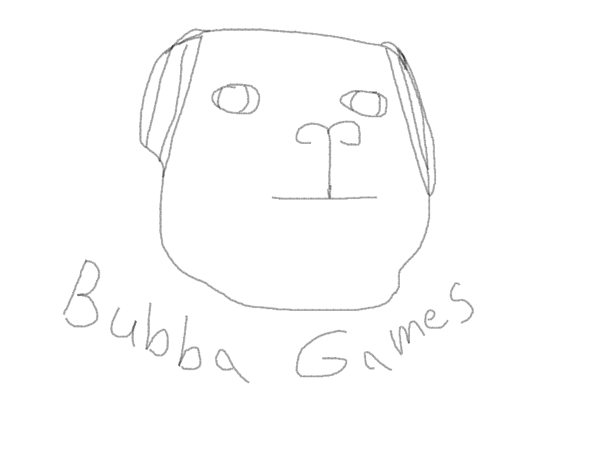

# Game Studio Brainstorming Template

## Studio Name Ideas
- **Primary Ideas:**
  - Bubba Games
  - Duck Duck Studios
  - The Strange Group
- **Alternative Ideas:**
  - Rouge Duck Games
  - Bubba Studios
  - Angry Duck Studios

- **Chosen Name**:
    Bubba Games
- **About the name**:
    Bubba was my dogs name and I enjoy making references to him.
- **Social Medias with name available**:
    BubbaGames
- **Possible domain names available**:
    BubbaGames.com
---

## Vision Statement
*What is the mission of your solo game studio? How does it align with creating and analyzing innovative game architectures?*

> The mission of my solo game studio is to create a game that I myself would have a lot of fun pouring hours into but also allows me to test new ways of being creative!
It aligns with creating and analyzing innovative game architectures because I would look at games I enjoy and see how I can scale the concept down to where a single developer can feasibly achieve it.

---

## Core Values
*What principles guide your studio's approach to game design, architecture, and development?*

- Plan out Core Features to a conceptual working state
- Modularity in the Architecture
- Clean and simple code
- Log everything and everywhere

---

## Target Audience
*Who are your games designed for? Identify your primary audience based on your focus on card and board games.*

- **Demographic:** Casual Players and Indie enjoyers.
- **Interests:** Multiplayer fun / strategy style games
- **Platforms:** PC

---

## Genre Focus
*What types of games will your studio focus on?*  
*Consider your course's emphasis on depth, mechanics, and balance in card and board games.*

- Rougelite inspirations
- Sci-fi/Fantasy

---

## Unique Selling Point (USP)
*What will make your games stand out from others, particularly in the indie/board game space?*

> Roguelite elements to the card and board games that allow fresh randomized experiences each time.

---

## Tools and Technology
*What tools and platforms will you use to develop, test, and publish your games?*

- **Game Engine(s):** Unity
- **Art Tools:** Blender
- **Audio Tools:** Audacity 
- **Version Control:** Github/Git
- **Publishing Platforms:** Itch.io

---

## Branding and Aesthetics
*What will your studio's visual identity look like?*

- **Logo Style:** Playful
- **Tagline Ideas:** 
  - "Always a fresh run!"
  - "Simple but strategic"
  - "Limited by your creativity"

-- **Sketches/Logo**:

---

## Additional Notes
